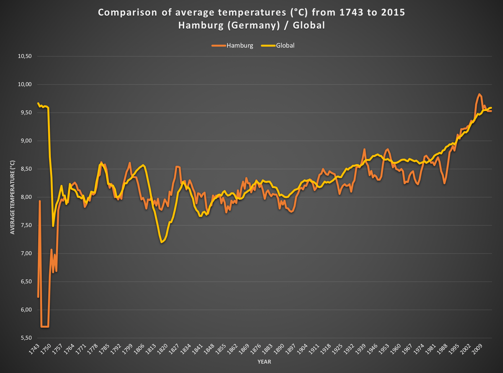

= T1P1 Exploring Weather Trends
Jörg Horchler <joerg@horchler.xyz>
:toc:
:source-highlighter: rouge
:pdf-page-size: Letter

== Summary

In this project, you will analyze local and global temperature data and compare
the temperature trends where you live to overall global temperature trends.

== Instructions

Your goal will be to create a visualization and prepare a write up describing
the similarities and differences between global temperature trends and
temperature trends in the closest big city to where you live. To do this,
you’ll follow the steps below:

* *Extract the data* from the database. There's a workspace in the next section
  that is connected to a database. You’ll need to export the temperature data
  for the world as well as for the closest big city to where you live. You can
  find a list of cities and countries in the *_city_list_* table. To interact
  with the database, you'll need to write a SQL query.
  ** Write a SQL query to extract the city level data. Export to CSV.
  ** Write a SQL query to extract the global data. Export to CSV.
* *Open up the CSV* in whatever tool you feel most comfortable using. We
  suggest using Excel or Google sheets, but you are welcome to use another
  tool, such as Python or R.
* *Create a line chart* that compares your city’s temperatures with the global
  temperatures. Make sure to plot the _moving average_ rather than the yearly
  averages in order to smooth out the lines, making trends more observable (the
  last concept in the previous lesson goes over how to do this in a
  spreadsheet).
* *Make observations* about the similarities and differences between the world
  averages and your city’s averages, as well as overall trends. Here are some
  questions to get you started.
  ** Is your city hotter or cooler on average compared to the global average?
     Has the difference been consistent over time?
  ** “How do the changes in your city’s temperatures over time compare to the
     changes in the global average?”
  ** What does the overall trend look like? Is the world getting hotter or
     cooler? Has the trend been consistent over the last few hundred years?

== Actions

I first read through the article
https://www.carbonbrief.org/explainer-how-do-scientists-measure-global-temperature[Explainer: How do scientists measure global temperature?]

I'll then do these steps:

. Inspect the tables in the database.
. Extract the data by joining city and global data.
. In the same step calculate a moving average. Why should I do that in Excel,
  Python, R or whatever instead of using analytic functions of the database?
. Export all data in one CSV.
. Import it in Excel. That's just because currently I feel most comfortable
  with plotting in Excel.
. Create the line chart to compare global and city data.
. Write down my observations.

=== Inspect the data

Step 1 is to get a list of all cities in my country. For that I select all
cities where country is equal to *Germany*.

.List of Cities in Germany
[source,sql]
----
SELECT city
  FROM city_list
 WHERE country = 'Germany'
 ORDER BY 1
;
----

The result list is very short. Only three cities are covered:

. Berlin
. Hamburg
. Munich

As I live near by Hamburg I choose this city.

Step 2 is then to select all fields of the table *city_data* where the country
is *Germany* and the city *Hamburg*.

.Data of Hamburg in Germany
[source,sql]
----
SELECT *
  FROM city_data
 WHERE country = 'Germany'
   AND city = 'Hamburg'
 LIMIT 10
;
----

The next step is to select all data of *global_data*.

.Global Weather Data
[source,sql]
----
SELECT *
  FROM global_data
 LIMIT 10
;
----

I can see that *global_data* and *city_data* share the fields *year* and
*avg_temp*. In addition I notice that

. Both tables to *not* share data of all years. Global data does not cover
  years 1743 to 1750 of Hamburg City data. City data does not cover years
  2014 and 2015 of the global data.
. Not all years do have a value in *avg_temp*.

=== Extract the data and calculate moving average in one query

As there are years in both tables that are not covered by the other I use a
FULL OUTER JOIN using a Common Table Expression selecting the data of the
city table. Using this method I get all years of both tables.
In this query I do only check whether the JOIN works as wanted.

.Combined city and global data
[source,sql]
----
WITH hamburg_data AS (
  SELECT cd.year AS hamburg_year
       , cd.avg_temp AS hamburg_avg_temp
    FROM city_data cd
   WHERE cd.country = 'Germany'
     AND cd.city = 'Hamburg'
)
SELECT hamburg_year
     , hamburg_avg_temp
     , global_data.year
     , global_data.avg_temp
  FROM hamburg_data
  FULL JOIN global_data
         ON global_data.year = hamburg_year
 ORDER BY hamburg_year, global_data.year
;
----

Next step is to calculate the Moving Average. This will be done by SQL too. I
build the window on the average of decades of 10 years. To be honest this is
just a gut feeling. Currently I don't know how to decide the size of the
window from a perspective of a Data Analyst. But I belive that this windows
size is good enough to visualize a trend.
As the database is PostgreSQL in the backend I use the functions available:

- COALESCE is used to ensure that the fields without value will be 0. This is
  done because otherwise I need to use some statistics to replace 0 with
  reasonable data.
- ROUND is used to round the average values to two digits after the comma.
- AVG is used to calculate the average of the averages.
- Finally the OVER function is used to build the window of 10 rows to
  calculate the window from. The values of *avg_temp* of these ten rows will
  be used to calculate the average of the current decade.

.Combined city and global data with moving average
[source,sql]
----
WITH hamburg_data AS (
  SELECT cd.year AS hamburg_year
       , COALESCE(cd.avg_temp, 0) AS hamburg_avg_temp
       , ROUND(AVG(cd.avg_temp) OVER (
           ORDER BY cd.year ROWS BETWEEN 9 PRECEDING AND CURRENT ROW
         ),2) AS hamburg_avg_decade
    FROM city_data cd
   WHERE cd.country = 'Germany'
     AND cd.city = 'Hamburg'
)
SELECT hamburg_year
     , hamburg_avg_temp
     , hamburg_avg_decade
     , global_data.year AS global_year
     , COALESCE(global_data.avg_temp, 0) AS global_avg_temp
     , ROUND(AVG(global_data.avg_temp) OVER(
        ORDER BY global_data.year ROWS BETWEEN 9 PRECEDING AND CURRENT ROW
       ),2) AS global_avg_decade
  FROM hamburg_data
  FULL JOIN global_data
         ON global_data.year = hamburg_year
 ORDER BY hamburg_year, global_data.year
;
----

NOTE: I used Postgres documentation and the Course *_SQL for Data Analysis_*
as well as my experience as Oracle Support Engineer to write these queries.

QUESTION: How can I deal with the NULL rows produced by the FULL JOIN on the
right table? As the left table contains years from 1743 to 1750 these rows
are missing on the right table (which is the global data). But the analytic
and window functions AVG() and OVER() produce weird results as you can see in
*global_avg_decade*.

=== Import the data in Excel

After importing the CSV file in Excel I need to clean it:

. Combine the years so that only one column is left for the year.
. Rename column headers because these are used in the chart.
. Manually calculate the average for 2014 and 2015 for Hamburg. Just
  calculate the average by using 0 as data value. So use the same average of
  2013.
. Reorder the columns to that the year and the two moving averages are within
  the first three columns.
. Hide avg_temp columns to have more space for the chart.

=== Create the line chart

To create the line chart I used Excel and formated it. To have a sufficent
brilliance the chart is filled with a dark background. To include it in PDF
I export it as png.

=== Observations

- The peaks at the beginning of the chart are due to missing data.
- The average temperature in Hamburg is more distributed as the global average.
  But the both series are similar.
  Perhaps this is because the measurements of a single city are more accurate
  than the global measurements because global temperatures are more averaged.
- In contrast that means that a trend is more recognizable using global data.
- The temperature of Hamburg and the global temperature is stable with ups and
  downs roughly between 8 and 8.5 °C until around 1920. After that a trend can
  be seen of rise in temperature.
- The exception of this stability is seen globally at 1816 having the
  "Year Without a Summer".
- The average temperature of Hamburg was a little bit colder than the global
  average but rised above it at 1995. Since then it is warmer than the global
  temperature.
