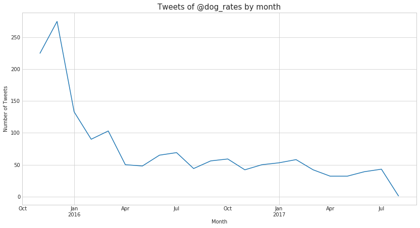
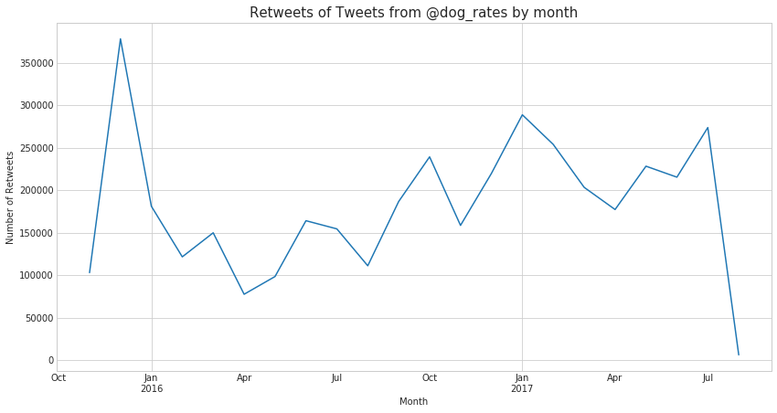
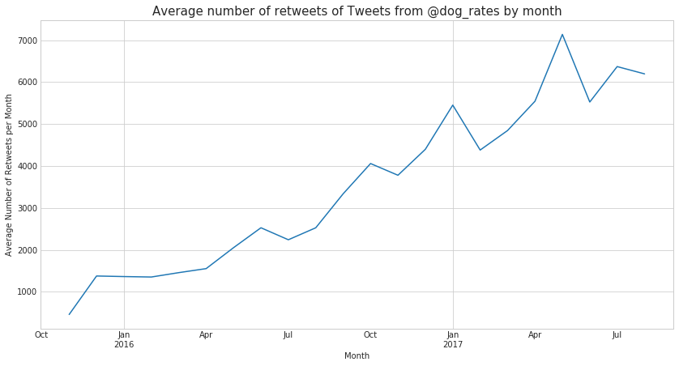
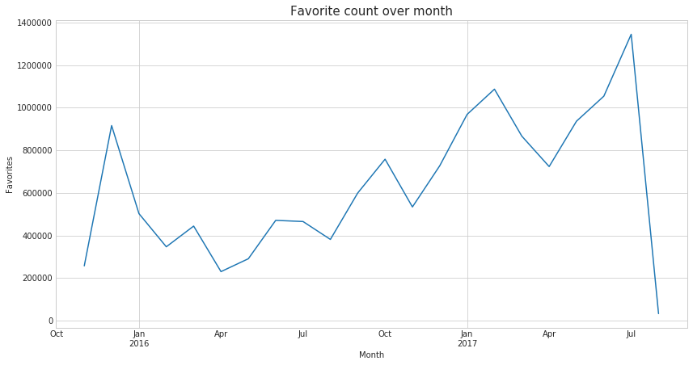
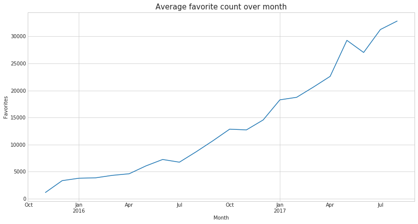
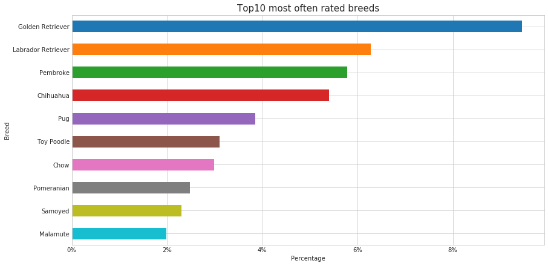
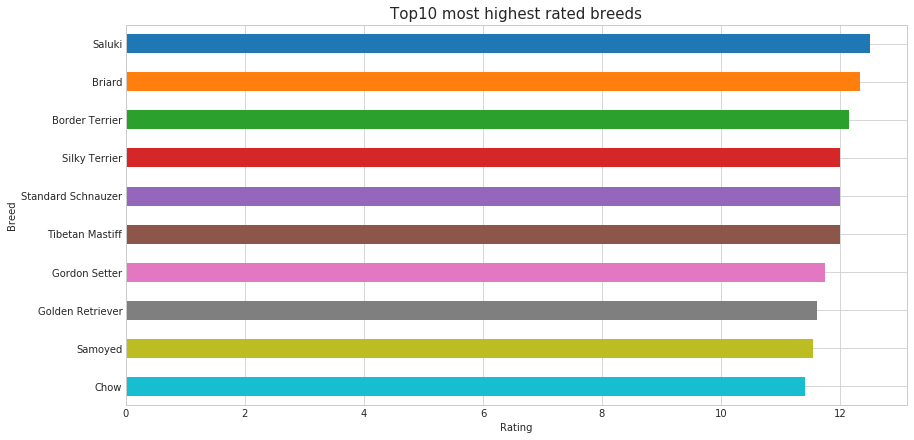
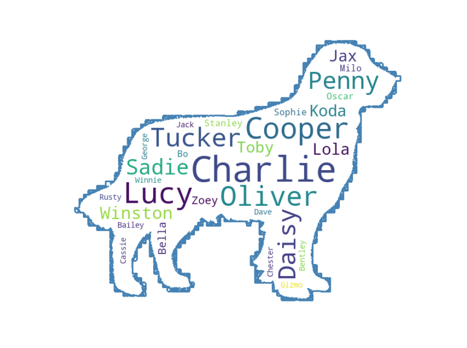
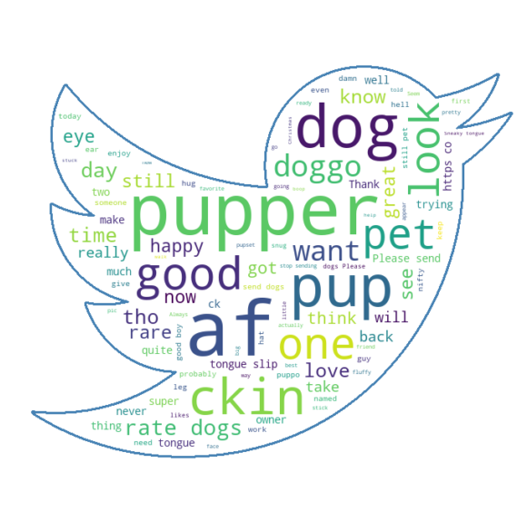

= Wrangle and Analyze Data: Documentation of analysis and insights
Jörg Horchler <joerg@horchler.xyz>
v1.0, 2018-10-21
:toc:
:sectnums:

@dog_rates is a twitter account that rates people's dogs with a humorous comment about the dog(s).
In theory the rates should be 1 to 10, because these ratings almost always have a denominator of 10.
However, almost all dogs deserve a 10 and sometimes more than that because __"they’re good dogs Brent"__.

I had access to around 1700 Tweets of @dog_rates (without retweets) to analyze them and share some insights.

== Tweets over time

First let's see the Tweets over time grouped by month.

Here we can see that the number of Tweets dropped over time.
This is interesting because this account has over 7 million followers.
I would suspect that someone having this large amount of followers woul Tweet more often.

== Retweets over time

As the number of followers increases I suspect the number of retweets of the account raises.

The positive trend can be seen here but ups and downs are visible too.
To show the trend more clear let's see the average number of retweets.

Now the trend is very clear.
Obviously Twitter is very effective if one has lots' of followers.
@dog_rates Tweets are retweeted alot, hence more people see it and more people become followers.

== Favorites over time

I suspect the same trend with the number of favorites over time.
The following plots show the total sum and the average of favorites of @dog_rates Tweets.

Again the trend is visible.
So having a lot of followers leads to more retweets and more favorites even if the number of Tweets drops.

== Ratings over time

Do more people follow @dog_rates due to the ratings?
Or for his humorous comments?

Let's first see the average rating over time.

image::avg_rating_by_month.png[Average rating by month]

On September 12th, 2016, Twitter user @brant took issue with @dog_rates rating system.
And he was right.
The average rating increases over time.
The two spikes in the plot are two fun ratings.
But we can see that the rating increases in fact.

Does the retweet and favorite count correlate with this?

[cols="h,m,m,m"]
|===
2+|favorite_count |retweet_count |rating_numerator

|favorite_count
|1.000000
|0.931722
|0.435072

|retweet_count
|0.931722
|1.000000
|0.351489

|rating_numerator
|0.435072
|0.351489
|1.000000
|===

The rating does not correlate that much with the number of retweets and favorite counts.
That means that the rating itself does not explain the high numbers of retweets.

In contrast the number of retweets and favorites correlate strong.
This is expected because the more retweets the more people can favorite the tweet.
And the opposite holds true as well I think: The more people favorite a Tweet the more people will retweet it.

I think that the rating itself is not the gist of these tweets but the Tweet text itself.
I think this is due to the sense of humor of @dog_rates and the text he uses to comment the images.
Perhaps it might be correlated with the breeds rated.

== Most and highest rated breeds

I compare the top 10 most often rated breeds with the top 10 highest rated breeds in the data set available.

Golden Retriever seem to be the most popular breed.

Contrary to this the highest rated breeds are Saluki and Briard and Border Terrier with an average rating above 12.
Golden Retriever is at rank 8 in this list.

== Most used names

Now let's do some fun plotting.
What are the most often used names in the text of the Tweets?

From this image we can see that the names Cooper, Tucker, Lucy, Charlie and Oliver are the most often used names.

== Most used text words

And finally what are the most often used words of @dog_rates?

Hey! *pupper* seems to be the most used word in the Tweets contained in the archive.
